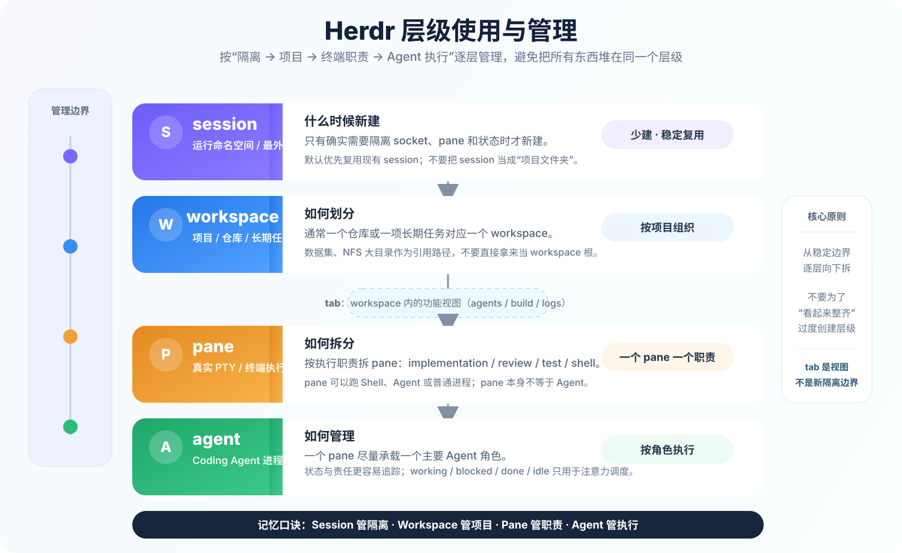

# Herdr 使用与工程经验

> 核查日期：2026-08-05。Herdr 仍处于快速迭代期，命令、Agent 支持和平台边界应以当前官方文档与 `herdr --help` 为准。

## 解决的问题

Herdr 是面向 Coding Agent 的终端复用器。它保留 tmux 类工具的后台 PTY、detach/attach 和 SSH 使用方式，同时增加：

- 自动识别 pane 中的 Coding Agent；
- 汇总 `working`、`blocked`、`done`、`idle`、`unknown` 等状态；
- 通过 workspace、tab 和 pane 组织多个项目；
- 通过 CLI 和本地 Socket API 创建布局、启动 Agent、发送提示、等待状态和读取终端结果；
- 直接连接某个 Agent，而不必进入完整 TUI。

它最适合：

- 同时运行多个 Codex、Claude Code、OpenCode、Hermes 等 Agent；
- 多仓库并行开发，需要快速定位哪个 Agent 正等待人工处理；
- 希望 Agent 或脚本编排其他 Agent，但仍保留真实终端界面；
- 本地、服务器和 SSH 场景使用同一种终端工作流。

它不应被误认为：

- tmux 在所有场景中的无条件替代品；
- 代码正确性、测试通过或任务完成的评价器；
- 机器重启后恢复任意进程指令现场的检查点系统；
- systemd、容器编排或任务调度器；
- 自动隔离多个 Agent 修改的版本控制系统。

---

## 与 tmux 的本质差异

```text
tmux
session → window → pane → 普通终端进程

Herdr
session → workspace → tab → pane → Agent
                                 ├── working
                                 ├── blocked
                                 ├── done
                                 ├── idle
                                 └── unknown
```

Herdr 的核心价值不是“更现代的分屏”，而是把 **Agent 身份、生命周期状态和可编排控制面** 放进终端复用器。

| 维度 | tmux | Herdr |
|---|---|---|
| 通用终端复用 | 成熟、普及 | 支持，但不是主要差异 |
| detach / attach | 支持 | 支持 |
| Agent 状态 | 不理解 Agent 语义 | 原生汇总 Agent 状态 |
| 自动化接口 | 通用命令、`send-keys`、`capture-pane` | Layout、Pane、Agent 分层 CLI / Socket API |
| 鼠标操作 | 可配置 | 原生强调点击、拖动、右键 |
| 插件和定制生态 | 成熟 | 较新、仍快速变化 |
| 服务器可获得性 | 发行版通常可直接安装 | 通常需要单独安装 |
| Windows | 通常经 WSL 使用 | 原生支持仍为 preview beta |

推荐边界：

```text
通用 SSH、训练、日志、运维兜底
    → tmux

多个 Coding Agent 的状态汇总和编排
    → Herdr
```

---

## 运行模型

日常管理时优先记住四个稳定边界：**session → workspace → pane → agent**。`tab` 是 workspace 内部的功能视图，用来组织 agents / build / logs 等工作面，不作为新的隔离边界。

<p align="center">
  
</p>

```text
Herdr client / TUI
       ↓
Herdr background server
       ↓
workspace / tab / pane
       ↓
PTY + Shell / Agent / 普通进程
```

- **session**：独立运行命名空间；只有确实需要完全隔离的 pane、socket 和状态时才创建多个；
- **workspace**：项目级容器，通常映射一个仓库或一项长期任务；
- **tab**：工作区内的功能视图；
- **pane**：一个真实终端和 PTY；
- **agent**：Herdr 在 pane 中识别出的 Coding Agent 进程；
- **client**：连接到 Herdr server 的本地或远程终端界面。

客户端 detach 后，server 持有的 pane 和进程可以继续运行。server 或主机停止后，原进程已经结束；恢复布局和重新调用 Agent 的原生 resume，不等于恢复任意进程的内存现场。

---

## 安装与验证

### Linux / macOS

官方安装脚本：

```bash
curl -fsSL https://herdr.dev/install.sh | sh
```

生产或受控环境建议先下载并审查：

```bash
curl -fsSLo /tmp/herdr-install.sh https://herdr.dev/install.sh
less /tmp/herdr-install.sh
sh /tmp/herdr-install.sh
```

已有包管理器时，优先让同一包管理器负责升级：

```bash
brew install herdr
# 或
mise use -g herdr
```

Nix 用户应固定 release tag，而不是无意跟踪开发分支。

检查：

```bash
herdr -V
herdr status
herdr --help
```

### Windows

截至核查日期，原生 Windows 是 preview beta，底层使用 ConPTY；部分 Unix PTY 行为、远程能力和输入法体验仍有差异。团队标准环境更稳妥的路径通常是：

```text
Windows Terminal
    ↓ SSH 或 WSL
Linux
    ↓
Herdr
```

不要在未做真实验证前，把 Windows preview 作为生产团队唯一标准。

---

## 最小使用闭环

### 1. 从项目目录启动

```bash
cd "$HOME/code/project-a"
herdr
```

默认会启动或连接后台 session；若 session 中还没有 workspace，会为当前目录创建一个工作区。

需要独立命名 session 时：

```bash
herdr --session agent-lab
```

查看：

```bash
herdr session list
herdr workspace list
herdr pane list
herdr agent list
```

### 2. 创建工作区

```bash
herdr workspace create \
    --cwd "$HOME/code/project-a" \
    --label project-a \
    --focus
```

一个 workspace 通常映射一个仓库。不要把巨型数据集根目录、NFS 全盘或包含大量无关文件的共享目录当成 workspace 根；工作区应以代码和任务控制面为中心，数据路径通过配置引用。

### 3. 创建布局

Herdr 支持鼠标点击 pane、拖动边界、右键分屏和创建 tab。默认 prefix 与 tmux 相似，为 `Ctrl-b`。

常用按键：

| 操作 | 默认按键 |
|---|---|
| 右侧分 pane | `Ctrl-b`，然后 `v` |
| 下方分 pane | `Ctrl-b`，然后 `-` |
| 新建 tab | `Ctrl-b`，然后 `c` |
| workspace 导航 | `Ctrl-b`，然后 `w` |
| pane 间移动 | `Ctrl-b`，然后 `h/j/k/l` |
| 放大当前 pane | `Ctrl-b`，然后 `z` |
| 关闭 pane | `Ctrl-b`，然后 `x` |
| 查看帮助 | `Ctrl-b`，然后 `?` |
| detach client | `Ctrl-b`，然后 `q` |

建议布局：

```text
workspace: project-a
├── tab: agents
│   ├── pane: implementation agent
│   ├── pane: review agent
│   └── pane: shell / git diff
├── tab: build
│   ├── pane: compiler
│   └── pane: tests
└── tab: logs
    └── pane: tail / grep
```

### 4. 直接启动 Agent

在 pane 中像普通终端一样运行：

```bash
codex
# 或
claude
# 或
opencode
# 或
hermes
```

支持的 Agent 即使未安装 integration，通常也能通过进程和屏幕规则被识别；integration 会进一步提供原生 session identity、生命周期状态或二者之一。

### 5. detach 与重新连接

正确 detach：

```text
Ctrl-b，然后 q
```

再次运行：

```bash
herdr
```

命名 session：

```bash
herdr session attach agent-lab
```

### 6. 正确结束

停止默认 server：

```bash
herdr server stop
```

停止命名 session：

```bash
herdr session stop agent-lab
```

这些命令会结束 session 中 pane 的进程，不是 detach。

---

## Agent integration

Herdr 可以自动检测 Agent；integration 用于增加原生 session restore、权威生命周期状态，或两者。

安装前先让目标 Agent 至少运行一次，确保配置目录存在，然后备份：

```bash
cp -a ~/.codex ~/.codex.before-herdr
cp -a ~/.claude ~/.claude.before-herdr
```

按需安装：

```bash
herdr integration install codex
herdr integration install claude
herdr integration install opencode
herdr integration install hermes
```

检查：

```bash
herdr integration status
```

安装后做差异审查：

```bash
diff -ru ~/.codex.before-herdr ~/.codex || true
diff -ru ~/.claude.before-herdr ~/.claude || true
```

### 状态来源并不统一

官方文档区分两类主要 authority：

1. **lifecycle hook/plugin authority**：integration 可以直接报告 `idle`、`working`、`blocked`；
2. **screen manifest authority**：Herdr 根据 Agent 终端界面和规则推断状态，integration 可能只提供原生 session identity。

例如在当前官方实现中，Codex 和 Claude Code 的 integration 主要提供 session identity，状态仍来自 screen manifest；OpenCode、Kimi、Pi 等部分 Agent 安装 integration 后可提供生命周期状态。

因此：

```text
同样显示 working / blocked / done
```

不代表所有 Agent 使用同等可靠的信号源。

---

## 远程使用

### 方式 A：在服务器上直接运行

```bash
ssh user@example.com
cd "$HOME/code/project-a"
herdr
```

此时 Herdr client 和 server 都在远端，行为最接近远程 tmux。

### 方式 B：本地 thin client 连接远端 Herdr

配置 SSH：

```sshconfig
Host workbox
    HostName example.com
    User user
    ServerAliveInterval 30
    ServerAliveCountMax 3
```

连接：

```bash
herdr --remote workbox
```

本地 client 通过 SSH 启动或连接远端 server，可桥接部分本地桌面能力。

认证失败时，先验证普通 SSH：

```bash
ssh workbox
```

有 passphrase 的密钥在非交互环境中应先加载：

```bash
ssh-add ~/.ssh/id_ed25519
herdr --remote workbox
```

截至核查日期，原生 Windows 客户端不支持 `herdr --remote`；Windows 用户应先 SSH 到远端 Linux，再运行 `herdr`。

---

## Agent 自动化

Herdr 将自动化分成三个层次：

| Primitive | 责任 |
|---|---|
| Layout | 创建 workspace、tab 和 pane 拓扑 |
| Pane | 控制普通终端，运行命令、发送文本、等待输出和读取内容 |
| Agent | 控制已识别 Agent，发送 prompt、等待生命周期状态和读取 Agent 终端 |

关键原则：

- pane 存在不代表里面有 Agent；
- `agent start` 需要一个已经存在且处于 Shell 提示符的 pane；
- 创建命令返回 JSON，应从结果读取 ID，不要预测 `w1:p2`；
- 普通测试、日志和服务使用 pane API；需要 Agent 身份和状态时才使用 agent API。

### 创建 pane、启动 Agent、等待并读取

依赖 `jq`：

```bash
split=$(herdr pane split --current --direction right --no-focus)
review_pane=$(printf '%s\n' "$split" | jq -r '.result.pane.pane_id')

herdr agent start reviewer \
    --kind codex \
    --pane "$review_pane"

herdr agent prompt reviewer \
    'Review the current diff and report correctness risks.' \
    --wait \
    --timeout 120000

herdr agent read reviewer \
    --source recent-unwrapped \
    --lines 120
```

### 等待阻塞状态

```bash
herdr agent wait reviewer \
    --until blocked \
    --timeout 120000

herdr agent read reviewer \
    --source recent-unwrapped \
    --lines 80
```

### 普通进程不要伪装成 Agent

```bash
herdr pane run w1:p3 'just test --watch'
herdr pane wait-output w1:p3 \
    --regex 'passed|failed' \
    --timeout 120000
```

### 自动化的验收边界

`agent prompt --wait` 等待的是 Herdr 观察到的生命周期状态，不跟踪一个 prompt 对应的严格事务边界。Agent 已在工作时，当前活动轮次结束也可能满足 wait。

因此关键任务还必须检查：

- Agent 写出的文件或 commit；
- `git diff` 是否在允许范围；
- 测试退出码；
- 静态检查和构建结果；
- 人工审查要求。

不要把：

```text
agent state == done
```

直接升级为：

```text
目标已经正确完成，可以合并或发布
```

---

## 公开经验与常见坑

### 1. `server stop` 不是 detach

**官方事实**：`Ctrl-b q` 只 detach client；`herdr server stop` 和 `session stop` 会结束 pane 中的进程。

**工程动作**：升级、清理和安装脚本不得无条件 stop server。先列出：

```bash
herdr session list
herdr workspace list
herdr pane list
herdr agent list
```

### 2. session restore 不等于进程 checkpoint

主机或 Herdr server 冷重启后：

- 布局和历史可以按支持范围恢复；
- 安装了当前 integration 且 Agent 提供原生 session reference 时，Herdr 可以重新调用 Agent 的 resume；
- 普通 Shell、编译、训练、服务和未支持 Agent 的原进程已经死亡。

长时间训练和生产服务仍应由专门任务系统管理。

### 3. Agent 状态可能误判

**官方机制**：部分 Agent 由 lifecycle integration 报告状态，部分 Agent 由 screen manifest 根据终端界面推断。

可能出现：

- Agent 界面升级后规则未匹配；
- 等待权限被识别为 `idle` 或 `unknown`；
- `done` 仅表示后台活动后进入可输入状态；
- pane 中存在 Agent，但状态无法高置信分类。

排查：

```bash
herdr agent explain <agent-or-pane>
herdr server update-agent-manifests
herdr server reload-agent-manifests
```

状态只能用于注意力调度和自动化等待，不能独立作为业务验收。

### 4. integration 会修改 Agent 配置

Codex integration 会写入 Hook 文件并调整 Codex 配置；Claude Code、OpenCode、Hermes 等也会写入各自配置目录。

**工程动作**：

1. 备份；
2. 安装一个 integration；
3. diff；
4. 启动 Agent 验证；
5. 再推广到其他机器。

不要在企业配置和自定义 Hook 未审查时批量安装。

### 5. Herdr 与 tmux 嵌套会丢失 Agent 可见性

Herdr 官方说明：Herdr pane 内再启动 tmux 时，Herdr 看到的是前台 `tmux`，不会穿透 tmux session 识别内层 Agent。

同时两者默认 prefix 都可能是 `Ctrl-b`，外层会先截获。

推荐：

```text
SSH → Herdr
```

而不是：

```text
SSH → tmux → Herdr → tmux
```

确需嵌套时，要明确外层只负责什么，并为两层使用不同 prefix。

### 6. 更新二进制不一定更新运行中的 server

Herdr 是 client/server 结构。升级新二进制后，旧 server 可能仍继续运行旧协议或旧代码。

检查：

```bash
herdr -V
herdr status
```

直接 stop server 会结束 pane 进程。官方提供实验性 live handoff：

```bash
herdr update --handoff
```

但它是 best effort，而且 Homebrew、mise、Nix 更新不通过该命令完成 handoff。关键任务期间不要为了追新版本重启 session；先完成或迁移任务，再升级。

### 7. 远程能力仍依赖普通 SSH

`herdr --remote` 不绕过 SSH 认证、代理、跳板机和密钥策略。先让：

```bash
ssh workbox
```

稳定工作，再排查 Herdr remote。不要把所有远程失败都归因于 Herdr。

### 8. 外层终端仍会影响输入

官方 troubleshooting 记录了：

- 老版本 Kitty、foot、Alacritty 在启用键盘事件报告时，Enter、Tab、Backspace 可能触发两次；
- 操作系统或外层终端可能先截获快捷键；
- Windows ConPTY 下原生光标与 CJK IME 候选窗口存在取舍。

排查顺序：

```text
操作系统快捷键
  ↓
外层终端
  ↓
SSH / tmux（如果有）
  ↓
Herdr
  ↓
Shell / Agent
```

先记录外层终端名称和版本，不要只改 Herdr 配置。

### 9. 多 Agent 并行不自动形成隔离

Herdr 隔离的是终端位置，不一定隔离文件系统。多个 Agent 在同一个 Git working tree 修改文件，仍可能互相覆盖、读取未提交变化或产生混合 commit。

推荐：

- 只读 review Agent 可共享工作树；
- 并行写入 Agent 使用独立 Git worktree 或独立 clone；
- 每个 Agent 有明确改动边界；
- 合并前统一检查 diff、测试和 commit。

这是版本控制责任，不是终端复用器能自动解决的问题。

### 10. 公开演示只能证明可用性，不能证明可靠性

Herdr 官方列出的社区 walkthrough 和第三方文章普遍肯定鼠标操作、Agent 状态汇总和远程体验，这些材料能说明真实用户可以完成安装和工作流，但通常没有：

- 长期错误率；
- 状态误判统计；
- 大规模团队协作数据；
- 生产故障恢复实验；
- 与 tmux 在稳定性上的受控对比。

因此应先在非关键仓库做试点，不根据演示视频直接全面替换 tmux。

---

## 推荐试点步骤

选择一台 Linux 开发机和一个非关键仓库：

### 第 1 阶段：只验证终端复用

- 创建 workspace、tab、pane；
- 运行 Shell、日志和测试；
- detach 后重新连接；
- 模拟 SSH 断线；
- 确认不会误用 `server stop`。

### 第 2 阶段：验证一个 Agent

- 安装一个 Agent integration；
- 检查配置 diff；
- 记录 `working`、`blocked`、`done`、`unknown` 的真实表现；
- 用 `agent explain` 分析误判。

### 第 3 阶段：验证两个独立工作树

- implementation Agent 使用 worktree A；
- review Agent 使用 worktree B 或只读检查；
- 明确最终由谁合并；
- 以测试和 diff 验收，而不是以状态灯验收。

### 第 4 阶段：再决定职责

只有以下条件满足时才扩大使用：

- detach/attach 稳定；
- Agent 状态误判不会误导关键操作；
- integration 修改可审计；
- 团队理解 server stop 的破坏性；
- tmux 或其他兜底路径仍可用。

---

## 系统化排错

### 1. 收集基础信息

```bash
herdr -V
herdr status
herdr session list
herdr workspace list
herdr pane list
herdr agent list
herdr integration status
```

同时记录：

```text
操作系统和架构
外层终端及版本
本地还是远程
是否经过 tmux
Agent 名称和版本
是否安装 integration
问题发生前是否升级
```

### 2. Agent 状态异常

```bash
herdr agent explain <agent-or-pane>
herdr server agent-manifests --json
herdr server update-agent-manifests
```

若修改了本地 manifest：

```bash
herdr server reload-agent-manifests
```

### 3. Remote 异常

```bash
ssh -vvv workbox
ssh workbox
herdr --remote workbox
```

先确认普通 OpenSSH 链路，再检查 Herdr bootstrap 和远端二进制路径。

### 4. 日志

默认日志目录：

```text
~/.config/herdr/
```

查看：

```bash
ls -lh ~/.config/herdr/*log*
tail -n 200 ~/.config/herdr/herdr-server.log
tail -n 200 ~/.config/herdr/herdr-client.log
```

增加调试：

```bash
HERDR_LOG=herdr=debug herdr
```

日志可能包含项目路径、终端输出和 Agent 信息，公开前必须脱敏。

### 5. 配置

Linux / macOS：

```text
~/.config/herdr/config.toml
```

查看完整默认配置：

```bash
herdr --default-config
```

不要一开始复制完整默认配置并全部维护；只添加需要覆盖的字段。无效配置通常会回退并显示启动警告，应先解决警告再排查其他行为。

---

## 推荐长期边界

```text
Herdr 负责
├── Agent 终端持久化
├── 多项目注意力调度
├── Agent 状态等待和跳转
└── Agent/Panes 的可编排控制面

Git / worktree 负责
├── 文件系统写入隔离
├── 历史和分支
└── 合并与回滚

测试与人工审查负责
├── 正确性
├── 范围控制
└── 是否允许合并或发布

systemd / scheduler / container 负责
├── 主机重启恢复
├── 资源治理
├── 健康检查
└── 生产服务生命周期
```

Herdr 最合理的定位是：

> 面向 Coding Agent 的终端运行时和注意力调度面，而不是完整的软件交付控制系统。

---

## 资料来源

### 官方资料

- 官方主页：https://herdr.dev/
- 文档入口：https://herdr.dev/docs/
- 安装：https://herdr.dev/docs/install/
- Quick start：https://herdr.dev/docs/quick-start/
- Concepts：https://herdr.dev/docs/concepts/
- Agents：https://herdr.dev/docs/agents/
- Agent automation：https://herdr.dev/docs/agent-automation/
- Integrations：https://herdr.dev/docs/integrations/
- Persistence and remote access：https://herdr.dev/docs/persistence-remote/
- Troubleshooting：https://herdr.dev/docs/troubleshooting/
- Configuration：https://herdr.dev/docs/configuration/
- 源码仓库：https://github.com/ogulcancelik/herdr

### 第三方经验线索

- 官方 releases 页面收录的独立 walkthrough，可用于观察真实安装、鼠标、远程和多 Agent 工作流：https://herdr.dev/releases/
- TecMint 的 Herdr 使用文章，可作为“多 Agent 状态难以用普通 tab/tmux 直接观察”的用户体验线索：https://www.tecmint.com/herdr-run-ai-coding-agents-in-linux-terminal/

### 证据边界

- 命令语义、状态 authority、平台支持和 integration 行为来自官方文档；
- 第三方文章和视频只证明有人完成过相应工作流，不证明长期稳定性或净效率提升；
- “适合试点但不应立即替换 tmux”“写入 Agent 应使用独立 worktree”等属于工程判断；
- Herdr 迭代快，状态、命令和支持矩阵必须结合核查日期理解；关键使用前应重新读取当前官方文档。